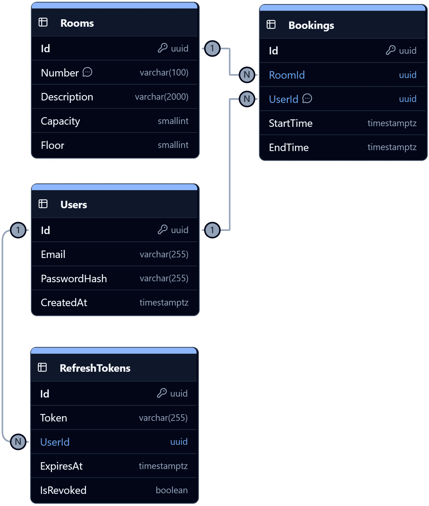

## Схема данных



<details>
  <summary>PL/PGSql код</summary>

```sql
CREATE SCHEMA IF NOT EXISTS "public";

CREATE TABLE "public"."RefreshTokens"
(
    "Id"        uuid         NOT NULL,
    "Token"     varchar(255) NOT NULL,
    "UserId"    uuid         NOT NULL,
    "ExpiresAt" timestamptz  NOT NULL,
    "IsRevoked" boolean      NOT NULL DEFAULT false,
    PRIMARY KEY ("Id")
);

CREATE TABLE "public"."Users"
(
    "Id"           uuid         NOT NULL,
    "Email"        varchar(255) NOT NULL,
    "PasswordHash" varchar(255) NOT NULL,
    "CreatedAt"    timestamptz  NOT NULL,
    PRIMARY KEY ("Id")
);

CREATE TABLE "public"."Rooms"
(
    "Id"          uuid          NOT NULL,
    -- Номер кабинета
    "Number"      varchar(100)  NOT NULL,
    "Description" varchar(2000) NOT NULL,
    "Capacity"    smallint      NOT NULL,
    "Floor"       smallint      NOT NULL,
    PRIMARY KEY ("Id")
);
COMMENT
ON COLUMN "public"."Rooms"."Number" IS 'Номер кабинета';

CREATE TABLE "public"."Bookings"
(
    "Id"        uuid        NOT NULL,
    "RoomId"    uuid        NOT NULL,
    -- Владелец брони
    "UserId"    uuid        NOT NULL,
    "StartTime" timestamptz NOT NULL,
    "EndTime"   timestamptz NOT NULL,
    PRIMARY KEY ("Id"),
    CHECK (StartTime < EndTime)
);
COMMENT
ON COLUMN "public"."Bookings"."UserId" IS 'Владелец брони';
-- Indexes
CREATE INDEX "Bookings_index_2" ON "public"."Bookings" ("RoomId", "StartTime", "EndTime");

-- Foreign key constraints
-- Schema: public
ALTER TABLE "public"."RefreshTokens"
    ADD CONSTRAINT "fk_RefreshTokens_UserId_Users_Id" FOREIGN KEY ("UserId") REFERENCES "public"."Users" ("Id");
ALTER TABLE "public"."Bookings"
    ADD CONSTRAINT "fk_Bookings_RoomId_Rooms_Id" FOREIGN KEY ("RoomId") REFERENCES "public"."Rooms" ("Id");
ALTER TABLE "public"."Bookings"
    ADD CONSTRAINT "fk_Bookings_UserId_Users_Id" FOREIGN KEY ("UserId") REFERENCES "public"."Users" ("Id");
```

</details>