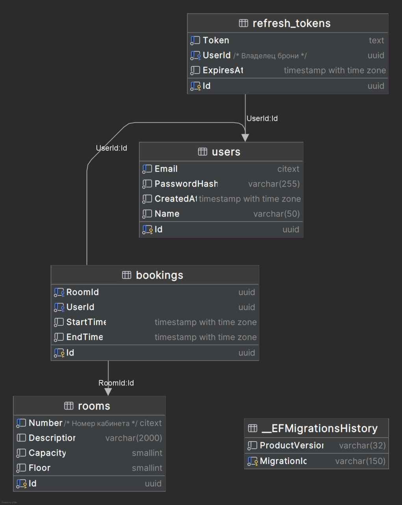

## Доступ к API (Scalar)

После успешного запуска контейнеров интерактивная документация API и клиент для отправки запросов будут доступны по адресу:
[http://localhost:8080/scalar/v1](http://localhost:8080/scalar/v1) *(при локальном запуске без Docker адрес может отличаться,
см. [launchSettings.json](RoomsBooking.API/Properties/launchSettings.json))*

## Архитектура и стек технологий

Проект спроектирован в соответствии с принципами **Clean Architecture** и использует паттерн **CQRS** для разделения операций чтения и записи.

* **Бэкенд:** C# / .NET
* **База данных:** PostgreSQL + Entity Framework Core
* **Изоляция бизнес-логики:** Валидация пересечений бронирований реализована — на уровне БД через **PostgreSQL Exclusion Constraints** (GIST индекс). Это предотвращает состояния гонки при
  параллельных запросах.
* **Документирование API:** Вместо стандартного Swagger UI используется более современный **Scalar**, полностью интегрированный со встроенной поддержкой OpenAPI.
* **Безопасность:** JWT-аутентификация с поддержкой Refresh-токенов. Пароли пользователей хэшируются с применением алгоритма **Argon2**.
* **Обработка ошибок:** Централизованная обработка исключений с возвратом стандартизированных ответов.

## Краткая инструкция

Для проверки работы функционала выполните следующие шаги в интерфейсе Scalar:

1. **Регистрация:** Выполните запрос `POST /api/v1/auth/register` (создание нового аккаунта).
2. **Авторизация:** Выполните запрос `POST /api/v1/auth/login`. Из полученного ответа скопируйте значение `accessToken`.
3. **Аутентификация в Scalar:** Нажмите кнопку авторизации в интерфейсе Scalar, выберите схему Bearer и вставьте скопированный токен.
4. **Добавление переговорки:** Выполните `POST /api/v1/rooms`, чтобы создать комнату (укажите номер, вместимость и этаж). Скопируйте `id` созданной комнаты.
5. **Создание брони:** Выполните `POST /api/v1/bookings`, передав `roomId` и желаемое время начала и окончания.
6. **Проверка пересечений:** Попробуйте создать еще одну бронь на эту же комнату с пересекающимся интервалом времени — система должна отклонить запрос с ошибкой.

## Запуск проекта

1. Клонируем репозиторий:
    ```bash
    git clone <репозиторий>
    cd <repo-name>
    ```
2. Настраиваем переменные окружения:  
   Создаем локальный файл `.env` в корне проекта, настраиваем переменные окружения по примеру из [.env.example](.env.example)
3. Запустите контейнеры с помощью Docker Compose в корне проекта:
    ```bash
    docker-compose up --build
    ```

## Миграции

#### Как создать новую миграцию

```bash
dotnet ef migrations add "Название миграции" --project RoomsBooking.Infrastructure --startup-project RoomsBooking.API
```

##### Применять миграции не требуется, это делается при старте приложения.

## Схема данных



<details>
  <summary>PL/PGSql код</summary>

```sql
create table public."__EFMigrationsHistory"
(
    "MigrationId"    varchar(150) not null
        constraint "PK___EFMigrationsHistory"
            primary key,
    "ProductVersion" varchar(32)  not null
);

alter table public."__EFMigrationsHistory"
    owner to postgres;

create table public.rooms
(
    "Id"          uuid     not null
        constraint "PK_rooms"
            primary key,
    "Number"      citext   not null
        constraint ck_rooms_number_max_length
            check (char_length(("Number")::text) <= 100),
    "Description" varchar(2000),
    "Capacity"    smallint not null,
    "Floor"       smallint not null
);

comment on column public.rooms."Number" is 'Номер кабинета';

alter table public.rooms
    owner to postgres;

create unique index "IX_rooms_Number"
    on public.rooms ("Number");

create table public.users
(
    "Id"           uuid                                      not null
        constraint "PK_users"
            primary key,
    "Email"        citext                                    not null
        constraint ck_users_email_max_length
            check (char_length(("Email")::text) <= 255),
    "PasswordHash" varchar(255)                              not null,
    "CreatedAt"    timestamp with time zone                  not null,
    "Name"         varchar(50) default ''::character varying not null
);

alter table public.users
    owner to postgres;

create table public.bookings
(
    "Id"        uuid                     not null
        constraint "PK_bookings"
            primary key,
    "RoomId"    uuid                     not null
        constraint "FK_bookings_rooms_RoomId"
            references public.rooms
            on delete cascade,
    "UserId"    uuid                     not null
        constraint "FK_bookings_users_UserId"
            references public.users
            on delete cascade,
    "StartTime" timestamp with time zone not null,
    "EndTime"   timestamp with time zone not null,
    constraint "EXCLUDE_overlapping_bookings"
        exclude using gist ("""RoomId""" with =, tstzrange("StartTime", "EndTime", '[)'::text) with &&)
);

alter table public.bookings
    owner to postgres;

create index "IX_bookings_RoomId"
    on public.bookings ("RoomId");

create index "IX_bookings_UserId"
    on public.bookings ("UserId");

create table public.refresh_tokens
(
    "Id"        uuid                     not null
        constraint "PK_refresh_tokens"
            primary key,
    "Token"     text                     not null,
    "UserId"    uuid                     not null
        constraint "FK_refresh_tokens_users_UserId"
            references public.users
            on delete cascade,
    "ExpiresAt" timestamp with time zone not null
);

comment on column public.refresh_tokens."UserId" is 'Владелец брони';

alter table public.refresh_tokens
    owner to postgres;

create unique index "IX_refresh_tokens_Token"
    on public.refresh_tokens ("Token");

create index "IX_refresh_tokens_UserId"
    on public.refresh_tokens ("UserId");

create unique index "IX_users_Email"
    on public.users ("Email");
```

</details>